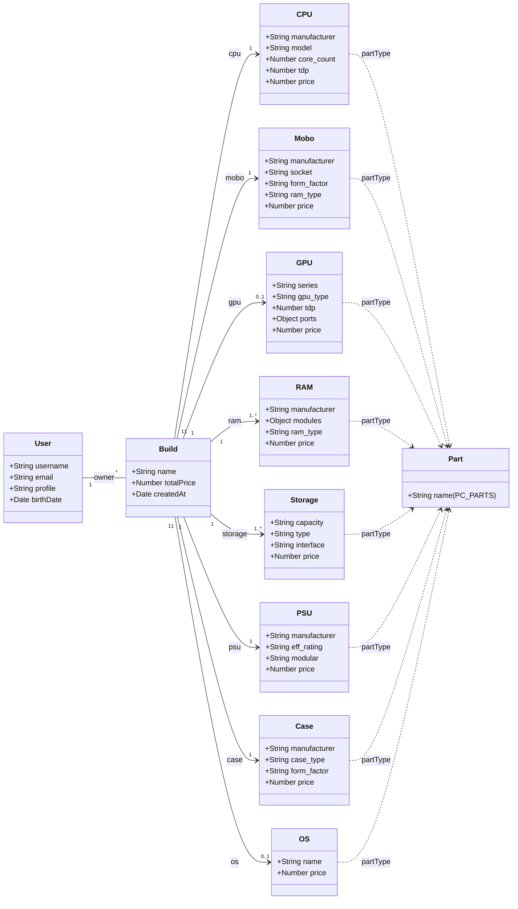
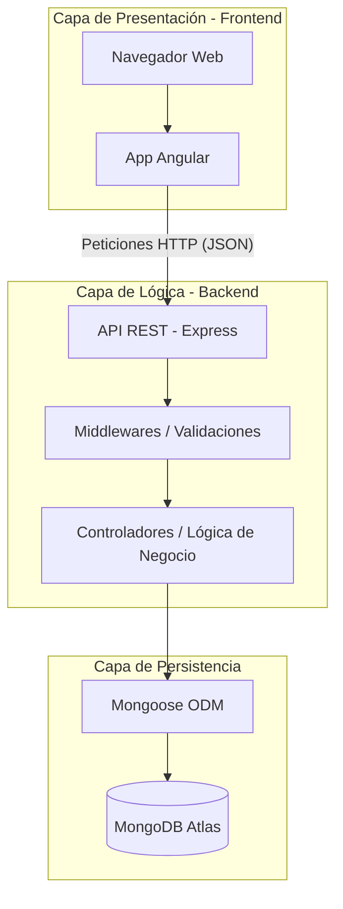

```bash
npx tree-node-cli -I "node_modules|tmp"
tree -I 'node_modules'

backExpress
├── package-lock.json
├── package.json
└── src
    ├── build-engine
    │   ├── compatibility.engine.js     
    │   ├── power.engine.js
    │   ├── price.engine.js
    │   └── validation.engine.js        
    ├── config
    │   ├── logger.config.js
    │   ├── mongodb.config.js
    │   └── swagger.config.js
    ├── constants
    │   ├── case_type.constant.js       
    │   ├── gpu.constant.js
    │   ├── index.constant.js
    │   ├── manufacturer.constant.js    
    │   ├── mobo_form_factor.constant.js    │   ├── os.constant.js
    │   ├── pc_parts.constant.js        
    │   ├── psu.constant.js
    │   ├── ram.constant.js
    │   ├── storage.constant.js
    │   └── wireless.constant.js        
    ├── database
    │   ├── buildSeeds
    │   │   └── builds.seed.js
    │   ├── seeds
    │   │   ├── partTypes.seed.js       
    │   │   └── parts.seed.js
    │   └── userSeeds
    │       └── users.seed.js
    ├── docs
    │   ├── _responses.yaml
    │   ├── auth.docs.yaml
    │   ├── build.docs.yaml
    │   ├── case.docs.yaml
    │   ├── cpu.docs.yaml
    │   ├── gpu.docs.yaml
    │   ├── home.docs.yaml
    │   ├── mobo.docs.yaml
    │   ├── os.docs.yaml
    │   ├── part.docs.yaml
    │   ├── psu.docs.yaml
    │   ├── ram.docs.yaml
    │   ├── storage.docs.yaml
    │   └── user.docs.yaml
    ├── index.js
    ├── middlewares
    │   ├── errorHandler.mw.js
    │   ├── jwt.mw.js
    │   ├── morgan.mw.js
    │   └── profile.mw.js
    ├── models
    │   ├── build.model.js
    │   ├── case.model.js
    │   ├── cpu.model.js
    │   ├── gpu.model.js
    │   ├── mobo.model.js
    │   ├── os.model.js
    │   ├── part.model.js
    │   ├── psu.model.js
    │   ├── ram.model.js
    │   ├── storage.model.js
    │   └── user.model.js
    ├── modules
    │   ├── auth
    │   │   ├── auth.controller.js      
    │   │   ├── auth.routes.js
    │   │   └── auth.service.js
    │   ├── build
    │   │   ├── build.controller.js     
    │   │   ├── build.routes.js
    │   │   └── build.service.js        
    │   ├── case
    │   │   ├── case.controller.js      
    │   │   ├── case.routes.js
    │   │   └── case.service.js
    │   ├── cpu
    │   │   ├── cpu.controller.js       
    │   │   ├── cpu.routes.js
    │   │   └── cpu.service.js
    │   ├── gpu
    │   │   ├── gpu.controller.js       
    │   │   ├── gpu.routes.js
    │   │   └── gpu.service.js
    │   ├── mobo
    │   │   ├── mobo.controller.js      
    │   │   ├── mobo.routes.js
    │   │   └── mobo.service.js
    │   ├── os
    │   │   ├── os.controller.js        
    │   │   ├── os.routes.js
    │   │   └── os.service.js
    │   ├── part
    │   │   ├── part.controller.js      
    │   │   ├── part.routes.js
    │   │   └── part.service.js
    │   ├── psu
    │   │   ├── psu.controller.js       
    │   │   ├── psu.routes.js
    │   │   └── psu.service.js
    │   ├── ram
    │   │   ├── ram.controller.js       
    │   │   ├── ram.routes.js
    │   │   └── ram.service.js
    │   ├── storage
    │   │   ├── storage.controller.js   
    │   │   ├── storage.routes.js       
    │   │   └── storage.service.js      
    │   └── user
    │       ├── user.controller.js      
    │       ├── user.routes.js
    │       └── user.service.js
    ├── public
    │   └── favicon.ico
    ├── routes
    │   └── index.routes.js
    ├── tests
    │   └── pcbuilder.echoapi.json      
    ├── utils
    │   ├── AppError.js
    │   ├── apiResponse.js
    │   ├── asyncHandler.js
    │   └── bcrypt.js
    ├── validators
    │   ├── array.validator.js
    │   └── integer.validator.js        
    └── views
```